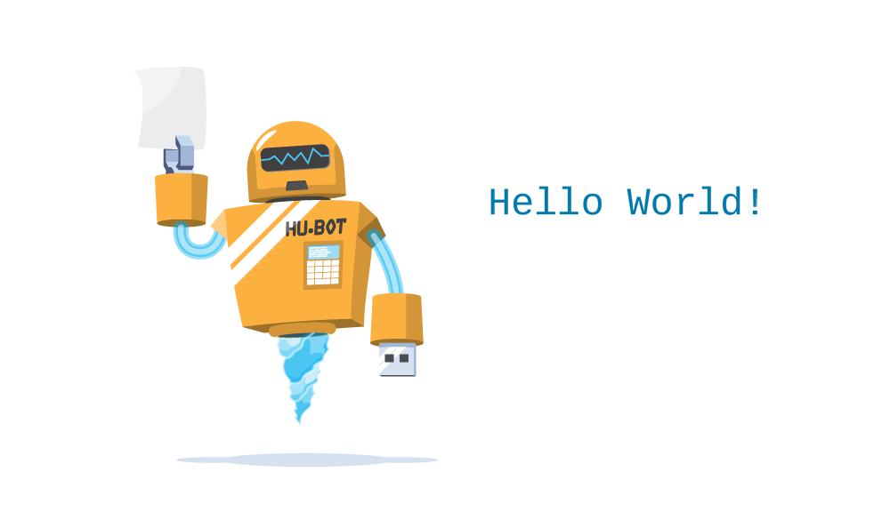

# Git Workshop voor Collega's

Welkom bij de Git Workshop! Deze tutorial is ontworpen om je te helpen Git te begrijpen en te gebruiken door middel van praktische voorbeelden. Laten we beginnen!

## Leren door Voorbeelden

In deze tutorial laten we Git-commando's zien zoals deze:

#### Voorbeeld

```sh
git --version
```

Uitvoer:
```
git version 2.30.2.windows.1
```

Voor nieuwe gebruikers kan het terminalvenster een beetje ingewikkeld lijken. Maak je geen zorgen! We houden het echt simpel, en op deze manier leren geeft je een goed begrip van hoe Git werkt.

In de bovenstaande code kun je commando's (invoer) en uitvoer zien.

### Invoer Commando:

```sh
git --version
```

### Uitvoer:

```
git version 2.30.2.windows.1
```

In het algemeen zijn regels met `$` ervoor invoercommando's. Dit zijn de commando's die je kunt kopiëren en uitvoeren in je terminal.

## Platform Wijzigen:

Schakel focus naar:
- GitHub
- Bitbucket
- GitLab

## Git en Externe Repositories

Git en GitHub zijn verschillende dingen. In deze tutorial leggen we uit wat Git is en hoe je het kunt gebruiken op externe repositoryplatforms zoals GitHub.

Je kunt kiezen en veranderen op welk platform je je wilt richten door in het menu aan de rechterkant te klikken: GitHub, GitLab, Bitbucket.

## Git en GitHub Introductie

### Wat is Git?

Git is een populair versiebeheersysteem gemaakt door Linus Torvalds in 2005, onderhouden door Junio Hamano.

**Gebruik:**
- Bijhouden van codewijzigingen
- Bijhouden wie wijzigingen heeft aangebracht
- Samenwerking bij codering

### Wat doet Git?

- Beheer projecten met Repositories
- Clone een project om aan een lokale kopie te werken
- Controleer en volg wijzigingen met Staging en Committing
- Branch en Merge om aan verschillende delen en versies van een project te werken
- Haal de laatste versie van het project naar een lokale kopie
- Push lokale updates naar het hoofdproject

## Werken met Git

- Initialiseer Git op een map, waardoor het een Repository wordt
- Git maakt een verborgen map aan om wijzigingen in die map bij te houden
- Wanneer een bestand wordt gewijzigd, toegevoegd of verwijderd, wordt het als gewijzigd beschouwd
- Selecteer de gewijzigde bestanden die je wilt Stagen
- De Gestagede bestanden worden Gecommit, waarbij Git een permanente momentopname van de bestanden opslaat
- Git stelt je in staat om de volledige geschiedenis van elke commit te zien
- Je kunt terugkeren naar elke eerdere commit
- Git slaat geen aparte kopie van elk bestand in elke commit op, maar houdt bij welke wijzigingen in elke commit zijn aangebracht

## Waarom Git?

- Meer dan 70% van de ontwikkelaars gebruikt Git!
- Ontwikkelaars kunnen overal ter wereld samenwerken.
- Ontwikkelaars kunnen de volledige geschiedenis van het project zien.
- Ontwikkelaars kunnen terugkeren naar eerdere versies van een project.

## Wat is GitHub?

GitHub maakt tools die Git gebruiken. Het is de grootste host van broncode ter wereld en is sinds 2018 eigendom van Microsoft.

In deze tutorial zullen we ons richten op het gebruik van Git met GitHub.

## Git Aan de Slag

### Git Installeren

Je kunt Git gratis downloaden van de volgende website: [Git SCM](https://www.git-scm.com/)

### Git gebruiken met Command Line

Om Git te gaan gebruiken, open je je Command shell.

- Voor Windows kun je Git Bash gebruiken, inbegrepen in Git voor Windows.
- Voor Mac en Linux gebruik je de ingebouwde terminal.

Controleer of Git correct is geïnstalleerd:

```sh
git --version
```

### Git Configureren

Stel je gebruikersnaam en e-mail in:

```sh
git config --global user.name "your-username"
git config --global user.email "your-email"
```

### Git Map Maken

Maak een nieuwe map voor je project:

```sh
mkdir myproject
cd myproject
```

Initialiseer Git in de map:

```sh
git init
```

### Nieuwe Bestanden Toevoegen

Maak en sla een HTML-bestand op met de naam `index.html` in de map.

```html
<!DOCTYPE html>
    <html>
    <head>
        <title>Hello World!</title>
    </head>
    <body>

        <h1>Hello world!</h1>
        <p>This is the first file in my new Git Repo.</p>

    </body>
</html>
```

Controleer de status:

```sh
git status
```

### Git Hulp

Als je hulp nodig hebt met Git-commando's:

```sh
git command -help
```

## Git Staging Environment

### Git Staging Environment

Een van de kernfuncties van Git is het concept van de Staging Environment en de Commit.

Terwijl je werkt, kun je bestanden toevoegen, bewerken en verwijderen. Maar telkens wanneer je een mijlpaal bereikt of een deel van het werk voltooit, moet je de bestanden toevoegen aan een Staging Environment.

Gestage bestanden zijn bestanden die klaar zijn om te worden gecommit naar de repository waaraan je werkt. Je leert straks meer over commit.

Voor nu zijn we klaar met werken aan index.html. Dus we kunnen het toevoegen aan de Staging Environment:

#### Voorbeeld

```sh
git add index.html
```

Het bestand zou nu gestaged moeten zijn. Laten we de status controleren:

#### Voorbeeld

```sh
git status
```

```
On branch master

No commits yet

Changes to be committed:
  (use "git rm --cached ..." to unstage)
    new file: index.html
```

Nu is het bestand toegevoegd aan de Staging Environment.

### Meer dan één bestand toevoegen

Je kunt ook meer dan één bestand tegelijk stagen. Laten we nog 2 bestanden toevoegen aan onze werkmap. Gebruik opnieuw de teksteditor.

Een README.md-bestand dat de repository beschrijft (aanbevolen voor alle repositories):

#### Voorbeeld

```
# hello-world
Hello World repository for Git tutorial
This is an example repository for the Git tutorial on https://www.w3schools.com

This repository is built step by step in the tutorial.
```

Een basis externe stijlblad (bluestyle.css):

#### Voorbeeld

```css
body {
    background-color: #f0f8ff;
    font-family: 'Arial', sans-serif;
    margin: 0;
    padding: 0;
    display: flex;
    justify-content: center;
    align-items: center;
    height: 100vh;
    color: #333;
}

h1 {
    color: #004080;
    margin-left: 0;
    font-size: 3em;
    text-shadow: 2px 2px 4px rgba(0, 0, 0, 0.2);
}

p {
    font-size: 1.2em;
    line-height: 1.6;
    color: #666;
    margin: 20px 0;
    padding: 0 20px;
    background: #fff;
    box-shadow: 0 4px 8px rgba(0, 0, 0, 0.1);
    border-radius: 8px;
    max-width: 600px;
    text-align: center;
}
```

En update index.html om het stylesheet op te nemen:

#### Voorbeeld

```html
<!DOCTYPE html>
<html>
<head>
<title>Hello World!</title>
<link rel="stylesheet" href="bluestyle.css">
</head>
<body>

<h1>Hello world!</h1>
<p>This is the first file in my new Git Repo.</p>

</body>
</html>
```

Voeg nu alle bestanden in de huidige directory toe aan de Staging Environment:

#### Voorbeeld

```sh
git add --all
```

Door `--all` te gebruiken in plaats van individuele bestandsnamen, worden alle wijzigingen (nieuwe, gewijzigde en verwijderde bestanden) gestaged.

#### Voorbeeld

```sh
git status
```

```
On branch master

No commits yet

Changes to be committed:
  (use "git rm --cached ..." to unstage)
        new file:   README.md
        new file:   bluestyle.css
        new file:   index.html
```

Nu zijn alle 3 bestanden toegevoegd aan de Staging Environment en we zijn klaar om onze eerste commit te doen.

Opmerking: De verkorte opdracht voor `git add --all` is `git add -A`

Nu checken we de status van de repository. Maar dit keer gebruiken we de --short optie om de changes compact weer te geven:

```sh
git status --short
```

#### Output
```
M index.html
```

Note: Short status flags are:

?? - Untracked files
A - Files added to stage
M - Modified files
D - Deleted files
We see the file we expected is modified. So let's commit it directly:

Een laatste shotcut die we laten zien is om direct een commit te doen, zonder eerst te stages. Dit is niet gebruikelijk, maar kan wel.

```sh
git commit -a -m "Updated index.html with a new line"
```
```
[master 09f4acd] Updated index.html with a new line
 1 file changed, 1 insertion(+)
 ```


## Werken met Git Branches

In Git is een branch een nieuwe/afzonderlijke versie van de hoofdrepository.

Stel dat je een groot project hebt en je moet het ontwerp bijwerken.

Hoe zou dat werken zonder en met Git:

### Zonder Git:

- Maak kopieën van alle relevante bestanden om te voorkomen dat de live versie wordt beïnvloed
- Begin met het werken aan het ontwerp en ontdek dat de code afhankelijk is van code in andere bestanden, die ook moeten worden gewijzigd!
- Maak ook kopieën van de afhankelijke bestanden. Zorg ervoor dat elke bestandsafhankelijkheid naar de juiste bestandsnaam verwijst
- NOODGEVAL! Er is een niet-gerelateerd probleem ergens anders in het project dat onmiddellijk moet worden opgelost!
- Sla al je bestanden op en noteer de namen van de kopieën waar je aan werkte
- Werk aan het niet-gerelateerde probleem en update de code om het op te lossen
- Ga terug naar het ontwerp en voltooi het werk daar
- Kopieer de code of hernoem de bestanden, zodat het bijgewerkte ontwerp op de live versie staat
- (2 weken later realiseer je je dat het niet-gerelateerde probleem niet is opgelost in de nieuwe ontwerpversie omdat je de bestanden hebt gekopieerd voordat de fix was aangebracht)

### Met Git:

- Maak een nieuwe branch genaamd `new-design` en bewerk de code rechtstreeks zonder de hoofdbranch te beïnvloeden
- NOODGEVAL! Er is een niet-gerelateerd probleem ergens anders in het project dat onmiddellijk moet worden opgelost!
- Maak een nieuwe branch van het hoofdproject genaamd `small-error-fix`
- Los het niet-gerelateerde probleem op en merge de `small-error-fix` branch met de hoofdbranch
- Ga terug naar de `new-design` branch en voltooi het werk daar
- Merge de `new-design` branch met de hoofdbranch (en krijg een melding over de kleine foutfix die je miste)

Branches stellen je in staat om aan verschillende delen van een project te werken zonder de hoofdbranch te beïnvloeden.

Wanneer het werk is voltooid, kan een branch worden samengevoegd met het hoofdproject.

Je kunt zelfs schakelen tussen branches en werken aan verschillende projecten zonder dat ze elkaar storen.

Branching in Git is zeer lichtgewicht en snel!

### Nieuwe Git Branch

Laten we enkele nieuwe functies toevoegen aan onze `index.html` pagina.

We werken in onze lokale repository en we willen het hoofdproject niet verstoren of mogelijk beschadigen.

Dus we maken een nieuwe branch aan:

#### Voorbeeld

```sh
git branch hello-world-images
```

Nu hebben we een nieuwe branch genaamd `hello-world-images` aangemaakt.

Laten we bevestigen dat we een nieuwe branch hebben gemaakt:

#### Voorbeeld

```sh
git branch
```

```
  hello-world-images
* master
```

We kunnen de nieuwe branch zien met de naam `hello-world-images`, maar de `*` naast `master` geeft aan dat we momenteel op die branch zitten.

`checkout` is het commando dat wordt gebruikt om een branch uit te checken. Het verplaatst ons van de huidige branch naar de branch die aan het einde van het commando is opgegeven:

#### Voorbeeld

```sh
git checkout hello-world-images
```

```
Switched to branch 'hello-world-images'
```

Nu hebben we onze huidige werkruimte verplaatst van de `master` branch naar de nieuwe branch.

Open je favoriete editor en maak wat wijzigingen.

Voor dit voorbeeld hebben we een afbeelding (`hello_world.webp`) toegevoegd aan de werkmap en een regel code in het `index.html` bestand:

#### Voorbeeld

```html
<!DOCTYPE html>
<html>
<head>
<title>Hello World!</title>
<link rel="stylesheet" href="bluestyle.css">
</head>
<body>

<h1>Hello world!</h1>
<div class="image-container">
    
</div>
<p>This is the first file in my new Git Repo.</p>


</body>
</html>
```

En voor de styling een nieuw css bestand voor bluestyle.css

```css
body {
    background-color: #f0f8ff;
    font-family: 'Arial', sans-serif;
    margin: 0;
    padding: 20px;
    display: flex;
    flex-direction: column;
    align-items: center;
    color: #333;
}

h1 {
    color: #004080;
    margin: 0;
    font-size: 3em;
    text-shadow: 2px 2px 4px rgba(0, 0, 0, 0.2);
    text-align: center;
}

p {
    font-size: 1.2em;
    line-height: 1.6;
    color: #666;
    margin: 10px 0 20px;
    text-align: center;
}

.image-container {
    display: flex;
    justify-content: center;
    width: 100%;
}

.image-container img {
    width: 100%;
    max-width: 960px;
    border-radius: 8px;
    box-shadow: 0 4px 8px rgba(0, 0, 0, 0.1);
}
```

We hebben wijzigingen aangebracht in een bestand en een nieuw bestand toegevoegd in de werkmap (dezelfde map als de hoofdbranch).

Controleer nu de status van de huidige branch:

#### Voorbeeld

```sh
git status
```

```
On branch hello-world-images
Changes not staged for commit:
  (use "git add ..." to update what will be committed)
  (use "git restore ..." to discard changes in working directory)
        modified:   bluestyle.css
        modified:   index.html

Untracked files:
  (use "git add ..." to include in what will be committed)
        hello_world.webp

no changes added to commit (use "git add" and/or "git commit -a")
```

Laten we eens kijken wat hier gebeurt:

- Er zijn wijzigingen in onze `index.html` en `bleustyle.css`, maar de bestanden zijn niet gestaged voor commit
- `hello_world.webp` is niet getrackt

Dus we moeten beide bestanden toevoegen aan de Staging Environment voor deze branch:

#### Voorbeeld

```sh
git add --all
```

Door `--all` te gebruiken in plaats van individuele bestandsnamen, worden alle wijzigingen (nieuwe, gewijzigde en verwijderde bestanden) gestaged.

Controleer de status van de branch:

#### Voorbeeld

```sh
git status
```

```
On branch hello-world-images
Changes to be committed:
  (use "git restore --staged ..." to unstage)
    new file: img_hello_world.jpg
    modified: index.html
```

We zijn tevreden met onze wijzigingen. Dus we zullen ze committen naar de branch:

#### Voorbeeld

```sh
git commit -m "Added image to Hello World"
```

```
[hello-world-images 0312c55] Added image to Hello World
 2 files changed, 1 insertion(+)
 create mode 100644 img_hello_world.jpg
```

Nu hebben we een nieuwe branch, die verschilt van de `master` branch.

Opmerking: Het gebruik van de `-b` optie bij `checkout` maakt een nieuwe branch en schakelt ernaar over, als deze nog niet bestaat.

### Wisselen tussen Branches

Laten we nu eens kijken hoe snel en gemakkelijk het is om met verschillende branches te werken en hoe goed het werkt.

We bevinden ons momenteel op de branch `hello-world-images`. We hebben een afbeelding aan deze branch toegevoegd, dus laten we de bestanden in de huidige map opsommen:

#### Voorbeeld

```sh
ls
```

```
README.md  bluestyle.css  img_hello_world.jpg  index.html
```

We kunnen het nieuwe bestand `img_hello_world.jpg` zien, en als we het html-bestand openen, kunnen we zien dat de code is gewijzigd. Alles is zoals het hoort te zijn.

Laten we nu eens kijken wat er gebeurt als we teruggaan naar de `master` branch:

#### Voorbeeld

```sh
git checkout master
```

```
Switched to branch 'master'
```

De nieuwe afbeelding maakt geen deel uit van deze branch. Lijst de bestanden in de huidige map opnieuw op:

#### Voorbeeld

```sh
ls
```

```
README.md  bluestyle.css  index.html
```

`img_hello_world.jpg` is er niet meer! En als we het html-bestand openen, kunnen we zien dat de code is teruggekeerd naar wat het was vóór de wijziging.

Zie je hoe gemakkelijk het is om met branches te werken? En hoe dit je in staat stelt om aan verschillende dingen te werken?

### Noodbranch

Stel nu dat we nog niet klaar zijn met `hello-world-images`, maar we moeten een fout in de `master` branch oplossen.

Ik wil niet direct in de `master` branch werken, en ik wil `hello-world-images` niet verstoren, aangezien het nog niet klaar is.

Dus we maken een nieuwe branch om het probleem aan te pakken:

#### Voorbeeld

```sh
git checkout -b emergency-fix
```

```
Switched to a new branch 'emergency-fix'
```

Nu hebben we een nieuwe branch van `master` gemaakt en zijn we ernaar overgeschakeld. We kunnen het probleem veilig oplossen zonder de andere branches te storen.

Laten we onze denkbeeldige fout oplossen:

#### Voorbeeld

```html
<!DOCTYPE html>
<html>
<head>
<title>Hello World!</title>
<link rel="stylesheet" href="bluestyle.css">
</head>
<body>

<h1>Hello world!</h1>
<p>This is the first file in my new Git Repo.</p>
<p>This line is here to show how merging works.</p>

</body>
</html>
```

We hebben wijzigingen aangebracht in dit bestand en we moeten die wijzigingen naar de `master` branch krijgen.

Controleer de status:

#### Voorbeeld

```sh
git status
```

```
On branch emergency-fix
Changes not staged for commit:
  (use "git add ..." to update what will be committed)
  (use "git restore ..." to discard changes in working directory)
        modified:   index.html

no changes added to commit (use "git add" and/or "git commit -a")
```

Stage het bestand en commit:

#### Voorbeeld

```sh
git add index.html
git commit -m "updated index.html with emergency fix"
```

```
[emergency-fix dfa79db] updated index.html with emergency fix
 1 file changed, 1 insertion(+), 1 deletion(-)
```

Nu hebben we een oplossing


## Git Branch Merge

### Branches Samenvoegen

We hebben de noodfix klaar, dus laten we de `master` en `emergency-fix` branches samenvoegen.

Eerst moeten we overschakelen naar de `master` branch:

#### Voorbeeld

```sh
git checkout master
```

```
Switched to branch 'master'
```

Nu voegen we de huidige branch (`master`) samen met `emergency-fix`:

#### Voorbeeld

```sh
git merge emergency-fix
```

```
Updating 09f4acd..dfa79db
Fast-forward
 index.html | 2 +-
 1 file changed, 1 insertion(+), 1 deletion(-)
```

Omdat de `emergency-fix` branch direct van `master` kwam, en er geen andere wijzigingen waren aangebracht in `master` terwijl we aan het werk waren, ziet Git dit als een voortzetting van `master`. Dus het kan "Fast-forward", waarbij zowel `master` als `emergency-fix` naar dezelfde commit wijzen.

Omdat `master` en `emergency-fix` in wezen hetzelfde zijn nu, kunnen we `emergency-fix` verwijderen, aangezien deze niet langer nodig is:

#### Voorbeeld

```sh
git branch -d emergency-fix
```

```
Deleted branch emergency-fix (was dfa79db).
```

## Git Branch Merge

### Branches Samenvoegen

We hebben de noodfix klaar, dus laten we de `master` en `emergency-fix` branches samenvoegen.

Eerst moeten we overschakelen naar de `master` branch:

#### Voorbeeld

```sh
git checkout master
```

```
Switched to branch 'master'
```

Nu voegen we de huidige branch (`master`) samen met `emergency-fix`:

#### Voorbeeld

```sh
git merge emergency-fix
```

```
Updating 09f4acd..dfa79db
Fast-forward
 index.html | 2 +-
 1 file changed, 1 insertion(+), 1 deletion(-)
```

Omdat de `emergency-fix` branch direct van `master` kwam, en er geen andere wijzigingen waren aangebracht in `master` terwijl we aan het werk waren, ziet Git dit als een voortzetting van `master`. Dus het kan "Fast-forward", waarbij zowel `master` als `emergency-fix` naar dezelfde commit wijzen.

Omdat `master` en `emergency-fix` in wezen hetzelfde zijn nu, kunnen we `emergency-fix` verwijderen, aangezien deze niet langer nodig is:

#### Voorbeeld

```sh
git branch -d emergency-fix
```

```
Deleted branch emergency-fix (was dfa79db).
```

### Merge Conflict

Nu kunnen we teruggaan naar `hello-world-images` en verder werken. Voeg nog een afbeeldingsbestand toe (`img_hello_git.jpg`) en wijzig `index.html`, zodat het deze weergeeft:

#### Voorbeeld

```sh
git checkout hello-world-images
```

```
Switched to branch 'hello-world-images'
```

#### Voorbeeld

```html
<!DOCTYPE html>
<html>
<head>
<title>Hello World!</title>
<link rel="stylesheet" href="bluestyle.css">
</head>
<body>

<h1>Hello world!</h1>
<div class="image-container">
    
</div>
<p>This is the first file in my new Git Repo.</p>


</body>
</html>
```

Nu zijn we klaar met ons werk hier en kunnen we de wijzigingen stagen en committen voor deze branch:

#### Voorbeeld

```sh
git add --all
git commit -m "added new image"
```

```
[hello-world-images 1f1584e] added new image
 2 files changed, 1 insertion(+)
 create mode 100644 img_hello_git.jpg
```

We zien dat `index.html` is gewijzigd in beide branches. Nu zijn we klaar om `hello-world-images` samen te voegen met `master`. Maar wat gebeurt er met de wijzigingen die we onlangs in `master` hebben aangebracht?

#### Voorbeeld

```sh
git checkout master
git merge hello-world-images
```

```
Auto-merging index.html
CONFLICT (content): Merge conflict in index.html
Automatic merge failed; fix conflicts and then commit the result.
```

De merge is mislukt, omdat er een conflict is tussen de versies van `index.html`. Laten we de status controleren:

#### Voorbeeld

```sh
git status
```

```
On branch master
You have unmerged paths.
  (fix conflicts and run "git commit")
  (use "git merge --abort" to abort the merge)

Changes to be committed:
        new file:   img_hello_git.jpg
        new file:   img_hello_world.jpg

Unmerged paths:
  (use "git add ..." to mark resolution)
        both modified:   index.html
```

Dit bevestigt dat er een conflict is in `index.html`, maar de afbeeldingsbestanden zijn klaar en gestaged om te worden gecommit.

Dus we moeten dat conflict oplossen. Open het bestand in onze editor:

#### Voorbeeld

```html
<!DOCTYPE html>
<html>
<head>
<title>Hello World!</title>
<link rel="stylesheet" href="bluestyle.css">
</head>
<body>

<h1>Hello world!</h1>
<<<<<<< HEAD
<p>This is the first file in my new Git Repo.</p>
<p>This line is here to show how merging works.</p>
=======
<div class="image-container">
    
</div>
<p>This is the first file in my new Git Repo.</p>

>>>>>>> hello-world-images

</body>
</html>
```

We kunnen de verschillen tussen de versies zien en deze bewerken zoals we willen:

#### Voorbeeld

```html
<!DOCTYPE html>
<html>
<head>
<title>Hello World!</title>
<link rel="stylesheet" href="bluestyle.css">
</head>
<body>

<h1>Hello world!</h1>

<p>This is the first file in my new Git Repo.</p>
<p>This line is here to show how merging works.</p>

<div class="image-container">
    
</div>
<p>This is the first file in my new Git Repo.</p>


</body>
</html>
```

Nu kunnen we `index.html` stagen en de status controleren:

#### Voorbeeld

```sh
git add index.html
git status
```

```
On branch master
All conflicts fixed but you are still merging.
  (use "git commit" to conclude merge)

Changes to be committed:
        new file:   img_hello_git.jpg
        new file:   img_hello_world.jpg
        modified:   index.html
```

Het conflict is opgelost en we kunnen `commit` gebruiken om de merge af te ronden:

#### Voorbeeld

```sh
git commit -m "merged with hello-world-images after fixing conflicts"
```

```
[master e0b6038] merged with hello-world-images after fixing conflicts
```

En verwijder de `hello-world-images` branch:

#### Voorbeeld

```sh
git branch -d hello-world-images
```

```
Deleted branch hello-world-images (was 1f1584e).
```

Nu heb je een beter begrip van hoe branches en merges werken. Tijd om te beginnen met werken met een externe repository!


## Werken met Externe Repositories

In deze sectie bespreken we hoe je Git kunt gebruiken met externe repositories, zoals GitHub.

### Verander Platform:
Schakel focus naar:
- GitHub
- Bitbucket
- GitLab

### Een Externe Repository Koppelen

Ga nu naar Github. Maak een account en log hierop in.

Maak een nieuwe Repo zonder inhoud.

Om een lokale repository te koppelen aan een externe repository, gebruik je het volgende commando:

### Voorbeeld

```sh
git remote add origin https://github.com/gebruikersnaam/repositorynaam.git
```

Dit commando stelt je in staat om de lokale repository te verbinden met een externe repository op GitHub.

### Voorbeeld

```sh
git remote -v
```

Dit commando toont de gekoppelde externe repositories en hun URL's.

### De Eerste Push

Om je lokale wijzigingen naar de externe repository te pushen, gebruik je:

### Voorbeeld

```sh
git push -u origin master
```

Dit commando push alle gecommitte wijzigingen naar de `master` branch van de `origin` repository.

Krijg je een error? Mooi ga dan naar de ssh_config_windows.md. Hierin staat beschreven hoe je een ssh verbinding opzet met github om zo veilig `git push` en `git pull` commando's uit te voeren.

Nu heb je je lokale repository succesvol gekoppeld en je eerste push naar een externe repository uitgevoerd.


## Git Pull van GitHub

### Verander Platform:
Schakel focus naar:
- GitHub
- Bitbucket
- GitLab

### Up-to-date Blijven met Wijzigingen
Wanneer je in een team aan een project werkt, is het belangrijk dat iedereen up-to-date blijft.

Elke keer dat je begint te werken aan een project, moet je de meest recente wijzigingen naar je lokale kopie halen.

Met Git kun je dat doen met `pull`.

`pull` is een combinatie van 2 verschillende commando's:

- `fetch`
- `merge`

Laten we eens nader bekijken hoe `fetch`, `merge` en `pull` werken.

### Git Fetch
`fetch` haalt alle wijzigingsgeschiedenis van een getrackte branch/repo op.

Dus, op je lokale Git, gebruik `fetch` om te zien wat er is veranderd op GitHub:

### Voorbeeld

```sh
git fetch origin
```

```
remote: Enumerating objects: 5, done.
remote: Counting objects: 100% (5/5), done.
remote: Compressing objects: 100% (3/3), done.
remote: Total 3 (delta 2), reused 0 (delta 0), pack-reused 0
Unpacking objects: 100% (3/3), 733 bytes | 3.00 KiB/s, done.
From https://github.com/w3schools-test/hello-world
   e0b6038..d29d69f  master     -> origin/master
```

Nu we de recente wijzigingen hebben, kunnen we onze status controleren:

### Voorbeeld

```sh
git status
```

```
On branch master
Your branch is behind 'origin/master' by 1 commit, and can be fast-forwarded.
  (use "git pull" to update your local branch)

nothing to commit, working tree clean
```

We lopen 1 commit achter op `origin/master`. Dat zou de bijgewerkte `README.md` moeten zijn, maar laten we het dubbelchecken door de log te bekijken:

### Voorbeeld

```sh
git log origin/master
```

```
commit d29d69ffe2ee9e6df6fa0d313bb0592b50f3b853 (origin/master)
Author: w3schools-test <77673807+w3schools-test@users.noreply.github.com>
Date:   Fri Mar 26 14:59:14 2021 +0100

    Updated README.md with a line about GitHub

commit e0b6038b1345e50aca8885d8fd322fc0e5765c3b (HEAD -> master)
Merge: dfa79db 1f1584e
Author: w3schools-test 
Date:   Fri Mar 26 12:42:56 2021 +0100

    merged with hello-world-images after fixing conflicts
```

Dat ziet er naar verwachting uit, maar we kunnen het ook verifiëren door de verschillen tussen onze lokale `master` en `origin/master` te tonen:

### Voorbeeld

```sh
git diff origin/master
```

```
diff --git a/README.md b/README.md
index 23a0122..a980c39 100644
--- a/README.md
+++ b/README.md
@@ -2,6 +2,4 @@
 Hello World repository for Git tutorial
 This is an example repository for the Git tutoial on https://www.w3schools.com

-This repository is built step by step in the tutorial.
-
-It now includes steps for GitHub
+This repository is built step by step in the tutorial.
\ No newline at end of file
```

Dat ziet er precies uit zoals verwacht! Nu kunnen we veilig mergen.

### Git Merge
`merge` combineert de huidige branch met een opgegeven branch.

We hebben bevestigd dat de updates naar verwachting zijn, en we kunnen onze huidige branch (`master`) mergen met `origin/master`:

### Voorbeeld

```sh
git merge origin/master
```

```
Updating e0b6038..d29d69f
Fast-forward
 README.md | 4 +++-
 1 file changed, 3 insertions(+), 1 deletion(-)
```

Controleer onze status opnieuw om te bevestigen dat we up-to-date zijn:

### Voorbeeld

```sh
git status
```

```
On branch master
Your branch is up to date with 'origin/master'.

nothing to commit, working tree clean
```

Klaar! Je lokale Git is up-to-date!

### Git Pull
Maar wat als je gewoon je lokale repository wilt bijwerken, zonder al deze stappen door te lopen?

`pull` is een combinatie van `fetch` en `merge`. Het wordt gebruikt om alle wijzigingen van een remote repository naar de branch waar je aan werkt te halen.

Maak een andere wijziging aan het `Readme.md` bestand op GitHub.

Gebruik `pull` om onze lokale Git bij te werken:

### Voorbeeld

```sh
git pull origin
```

```
remote: Enumerating objects: 5, done.
remote: Counting objects: 100% (5/5), done.
remote: Compressing objects: 100% (3/3), done.
remote: Total 3 (delta 1), reused 0 (delta 0), pack-reused 0
Unpacking objects: 100% (3/3), 794 bytes | 1024 bytes/s, done.
From https://github.com/w3schools-test/hello-world
   a7cdd4b..ab6b4ed  master       -> origin/master
Updating a7cdd4b..ab6b4ed
Fast-forward
 README.md | 2 ++
 1 file changed, 2 insertions(+)
```

Zo houd je je lokale Git up-to-date met een remote repository. In het volgende hoofdstuk zullen we nader bekijken hoe `push` werkt op GitHub.
